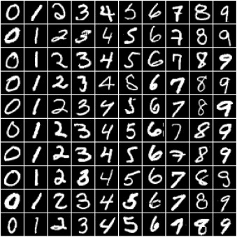
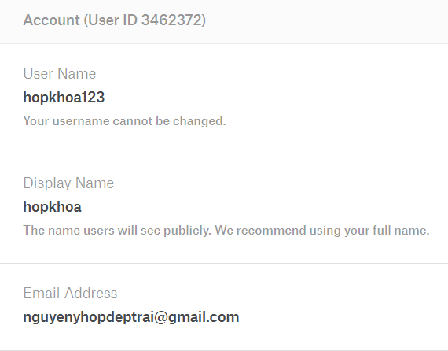
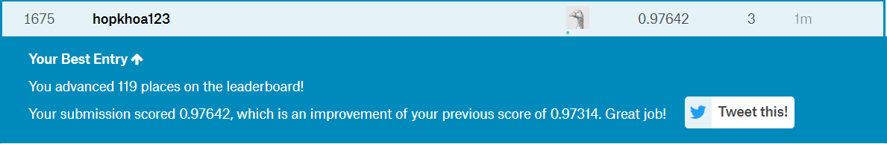

# STUDENT
1612221- NGUYEN Y HOP

# MNIST
The data files **train.csv** and **test.csv** contain gray-scale images of hand-drawn digits, from zero through nine.

Each image is 28 pixels in height and 28 pixels in width, for a total of 784 pixels in total. Each pixel has a single pixel-value associated with it, indicating the lightness or darkness of that pixel, with higher numbers meaning darker. This pixel-value is an integer between 0 and 255, inclusive.

The training data set, (train.csv), has 785 columns. The first column, called "label", is the digit that was drawn by the user. The rest of the columns contain the pixel-values of the associated image.

# Software requirements

Python 3.6, Keras 2.2.4, numpy, matplotlib, scikit-learn, pandas, csv

# Improve Model
All models have: 

**input layer + 1 hidden layer(activation='relu) + 1 ouput layer(activation='softmax')**

The process of improving the model by changing the following parameters:

  **Number node**

  **Learning rate**

  **Batch size**

  **Epoch**
  
# Run Program

Download the **train.csv** and **test.csv** file following the link below:

MNIST: **https://www.kaggle.com/c/digit-recognizer/data**

Run file NN_MNIST.ipynb, run all cell. You receive file sample_submission.csv

Submit sample_submission.csv at **https://www.kaggle.com/c/digit-recognizer/submit**

# Experience

| Model |	Number node	| Batch size	| Epoch	| Learning rate | Acc_Val |
|---|---|---|---|---|---|
| Model 1 |	784	| 32 |64 | 0.05 | 0.9763 |
| Model 2	| 512 |64 | 64 | 0.1	| 0.9757 |
| Model 3 |	1024 | 64 |	64 | 0.1 | 0.9785 |
| Model 4 |	256 |	128 |	64 | 0.1 | 0.9714 |
| Model 5 | 1024 | 128 | 64 | 0.1 | 0.9745 |
| Model 6 | 1000 | 32 | 64 | 0.1 | 0.9760 |
| Model 7 | 1000 | 32 | 32 | 0.1 | **0.9798** |

# Results

Model traing on training set 42,000 samples which devide into 33,600 training set and 8,400 valid set.

Traning accuracy: 1.0

Validation accuracy: 0.9798

**model: Model: Input + 1000 node hidden layer+ 10 node output sofmax**

# Kaggle

### Account

### Rank

